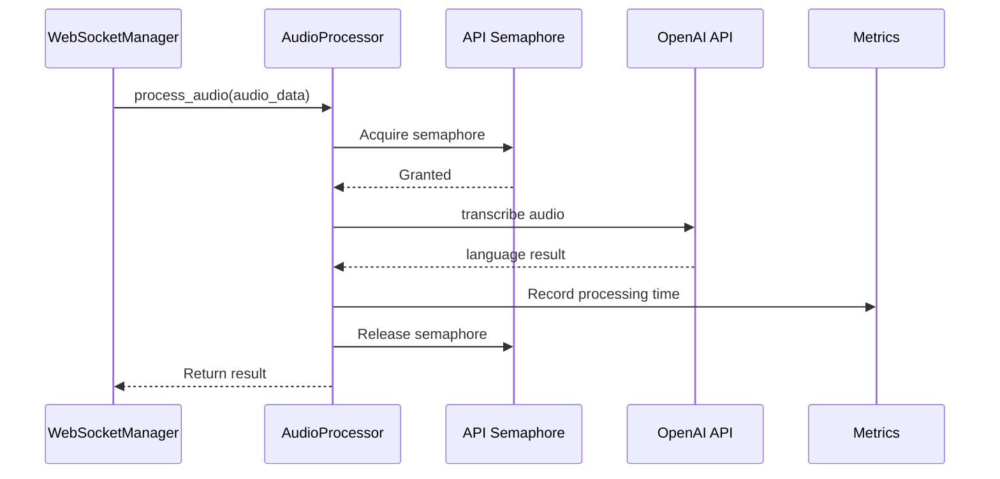
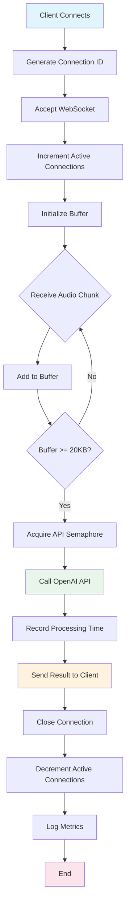

## Overview

The LangShazam backend is built with FastAPI, leveraging Python's async capabilities for high-performance real-time audio processing. The architecture is modular, with clear separation of concerns across different components.

## Application Structure

### Main Application Entry Point

The application is initialized in `backend/src/main.py:24-39` with FastAPI and CORS middleware:

```python
app = FastAPI()

# Add CORS middleware
app.add_middleware(
    CORSMiddleware,
    allow_origins=CORS_ORIGINS,
    allow_credentials=True,
    allow_methods=["*"],
    allow_headers=["*"],
)

# Initialize components
metrics = ServerMetrics()
audio_processor = AudioProcessor(api_key=os.getenv("OPENAI_API_KEY"))
ws_manager = WebSocketManager(audio_processor, metrics)
```

<Note>
  The application uses dependency injection pattern, passing shared instances of `AudioProcessor` and `ServerMetrics` to the `WebSocketManager`.
</Note>

## Core Components

### AudioProcessor

**Location:** `backend/src/audio_processor.py`

<Card title="Purpose" icon="gears">
  Handles all audio processing and OpenAI API interactions with rate limiting and connection tracing.
</Card>

#### Key Features

<Accordion title="Rate Limiting with Semaphores">
  The AudioProcessor implements concurrent call limiting using asyncio semaphores:
  
  ```python
  def __init__(self, api_key: str, max_concurrent_calls: int = 3):
      self.client = OpenAI(api_key=api_key.strip())
      self.api_semaphore = asyncio.Semaphore(max_concurrent_calls)
  ```
  
  This prevents overloading the OpenAI API and ensures fair resource distribution across connections.
  
  Reference: `audio_processor.py:15-17`
</Accordion>

<Accordion title="OpenAI API Integration">
  Audio is sent to OpenAI's Whisper-1 model for transcription:
  
  ```python
  async def call_openai_api(self, audio_data: bytes, connection_id: str):
      async with self.api_semaphore:
          audio_file = io.BytesIO(audio_data)
          audio_file.name = "audio.mp4"
          
          response = await asyncio.to_thread(
              self.client.audio.transcriptions.create,
              model="whisper-1",
              file=audio_file,
              response_format="verbose_json"
          )
          return response
  ```
  
  The method uses `asyncio.to_thread()` to prevent blocking the event loop.
  
  Reference: `audio_processor.py:19-42`
</Accordion>

<Accordion title="Connection Tracing">
  Every request includes a unique connection ID for tracking:
  
  ```python
  logger.info(f"[{connection_id}] Starting audio processing")
  logger.info(f"[{connection_id}] OpenAI API call completed in {api_time:.2f}s")
  ```
  
  This enables debugging and performance analysis for individual requests.
  
  Reference: `audio_processor.py:53, 41`
</Accordion>

#### Processing Flow



### WebSocketManager

**Location:** `backend/src/websocket_manager.py`

<Card title="Purpose" icon="plug">
  Manages WebSocket connections, coordinates audio buffering, and handles the request-response lifecycle.
</Card>

#### Connection Lifecycle

<Steps>
  <Step title="Connection Establishment">
    When a client connects, a unique 8-character connection ID is generated:
    
    ```python
    connection_id = str(uuid.uuid4())[:8]
    await websocket.accept()
    self.metrics.active_connections += 1
    ```
    
    Reference: `websocket_manager.py:19-22`
  </Step>
  
  <Step title="Audio Buffering">
    Incoming audio chunks are buffered until minimum size is reached:
    
    ```python
    buffer = []
    total_size = 0
    MIN_AUDIO_SIZE = 20000  # 20KB minimum
    
    while True:
        data = await websocket.receive_bytes()
        buffer.append(data)
        total_size += len(data)
        
        if total_size >= MIN_AUDIO_SIZE:
            audio_data = b''.join(buffer)
            result = await self.audio_processor.process_audio(...)
    ```
    
    Reference: `websocket_manager.py:29-49`
  </Step>
  
  <Step title="Processing & Response">
    Once enough audio is buffered, it's processed and results are sent:
    
    ```python
    await websocket.send_json({
        "status": "success",
        "data": result,
        "timestamp": datetime.now().isoformat(),
        "connection_id": connection_id
    })
    ```
    
    Reference: `websocket_manager.py:65-70`
  </Step>
  
  <Step title="Connection Cleanup">
    Connections are properly closed and metrics updated:
    
    ```python
    finally:
        self.metrics.active_connections -= 1
        self.metrics.log_current_metrics(connection_id)
    ```
    
    Reference: `websocket_manager.py:90-92`
  </Step>
</Steps>

#### Error Handling

<Warning>
  The WebSocketManager implements comprehensive error handling for various failure scenarios.
</Warning>

```python
try:
    # Main processing loop
except WebSocketDisconnect:
    logger.info(f"[{connection_id}] Connection disconnected")
except Exception as e:
    self.metrics.errors += 1
    logger.error(f"[{connection_id}] WebSocket error: {e}")
    await websocket.send_json({
        "status": "error",
        "message": str(e),
        "timestamp": datetime.now().isoformat(),
        "connection_id": connection_id
    })
```

Reference: `websocket_manager.py:78-89`

### ServerMetrics

**Location:** `backend/src/metrics.py`

<Card title="Purpose" icon="chart-bar">
  Collects and reports server performance metrics including connections, processing times, CPU, and memory usage.
</Card>

#### Tracked Metrics

```python
class ServerMetrics:
    def __init__(self):
        self.active_connections = 0
        self.processing_times = deque(maxlen=100)  # Rolling window
        self.active_processes = 0
        self.total_requests = 0
        self.errors = 0
        self.cpu_cores = multiprocessing.cpu_count()
```

Reference: `metrics.py:15-21`

#### Metric Categories

<CardGroup cols={2}>
  <Card title="Connection Metrics" icon="link">
    - Active connections
    - Total requests
    - Error count
  </Card>
  <Card title="Performance Metrics" icon="gauge-high">
    - Average processing time
    - Per-request timing (last 100)
  </Card>
  <Card title="System Metrics" icon="server">
    - Memory usage (MB)
    - CPU usage (total & per-core)
    - Effective cores utilized
  </Card>
  <Card title="Process Metrics" icon="microchip">
    - Active processes
    - CPU core count
  </Card>
</CardGroup>

#### Metrics Logging

<Accordion title="Detailed Metrics Output">
  Metrics are logged with connection context:
  
  ```python
  def log_current_metrics(self, connection_id: str = None):
      prefix = f"[{connection_id}]" if connection_id else ""
      logger.info(
          f"\n=== Server Metrics {prefix} ===\n"
          f"Active Connections: {self.active_connections}\n"
          f"Total Requests: {self.total_requests}\n"
          f"Avg Processing Time: {avg_processing_time:.2f}s\n"
          f"Memory Usage: {memory_usage:.2f}MB\n"
          f"Total CPU Usage: {cpu_percent}%\n"
          f"Effective Cores Used: {cpu_percent/100 * self.cpu_cores:.1f} of {self.cpu_cores}\n"
      )
  ```
  
  Reference: `metrics.py:23-44`
</Accordion>

## Request Flow & Lifecycle



## Configuration System

**Location:** `backend/src/config/settings.py`

The backend uses a centralized configuration system with environment variable support:

<Tabs>
  <Tab title="Server Config">
    ```python
    SERVER_CONFIG = {
        "host": "0.0.0.0",
        "port": int(os.getenv("PORT", "10000")),
        "debug": os.getenv("DEBUG", "false").lower() == "true"
    }
    ```
  </Tab>
  
  <Tab title="Audio Config">
    ```python
    AUDIO_CONFIG = {
        "min_audio_size": 20000,
        "chunk_size": 128 * 1024,
        "min_audio_length": 4000,
        "max_audio_length": 15000,
        "audio_bits_per_second": 16000
    }
    ```
  </Tab>
  
  <Tab title="OpenAI Config">
    ```python
    OPENAI_CONFIG = {
        "model": "whisper-1",
        "max_concurrent_calls": 3
    }
    ```
  </Tab>
  
  <Tab title="Logging Config">
    ```python
    LOGGING_CONFIG = {
        "level": "INFO",
        "format": "%(asctime)s [%(levelname)s] %(message)s",
        "datefmt": "%Y-%m-%d %H:%M:%S"
    }
    ```
  </Tab>
</Tabs>

## Error Handling and Logging

### Logging Strategy

<Card title="Structured Logging" icon="list">
  The backend implements structured logging with connection tracing throughout the request lifecycle.
</Card>

**Configuration** (`main.py:16-22`):

```python
logging.basicConfig(
    level=getattr(logging, LOGGING_CONFIG["level"]),
    format=LOGGING_CONFIG["format"],
    datefmt=LOGGING_CONFIG["datefmt"]
)
logger = logging.getLogger(__name__)
```

### Error Categories

<Accordion title="WebSocket Errors">
  Handled in `websocket_manager.py:78-89`:
  
  - **WebSocketDisconnect**: Clean client disconnection
  - **Processing Errors**: Errors during audio processing
  - **General Exceptions**: Unexpected errors with full error reporting
</Accordion>

<Accordion title="API Errors">
  Handled in `audio_processor.py:43-45`:
  
  - OpenAI API failures
  - Network timeouts
  - Rate limit exceeded
  
  All errors are logged with connection ID and increment the error counter.
</Accordion>

### Memory Management

<Note>
  The AudioProcessor explicitly calls garbage collection after processing to manage memory:
</Note>

```python
finally:
    gc.collect()
```

Reference: `audio_processor.py:72`

## API Endpoints

### WebSocket Endpoint

<Card title="/ws" icon="plug">
  **Protocol:** WebSocket  
  **Purpose:** Real-time language detection  
  **Handler:** `websocket_endpoint`
</Card>

**Implementation** (`main.py:51-57`):

```python
@app.websocket("/ws")
async def websocket_endpoint(websocket: WebSocket):
    connection_start = time.time()
    await ws_manager.handle_connection(websocket)
    connection_duration = time.time() - connection_start
    logger.info(f"WebSocket connection duration: {connection_duration:.2f}s")
```

### REST Endpoints

<CardGroup cols={2}>
  <Card title="GET /" icon="home">
    Health check endpoint
    
    ```python
    @app.get("/")
    async def home():
        return {"message": "Server is running!"}
    ```
    
    Reference: `main.py:41-44`
  </Card>
  
  <Card title="GET /metrics" icon="chart-line">
    Server metrics endpoint
    
    ```python
    @app.get("/metrics")
    async def get_metrics():
        return metrics.get_metrics_dict()
    ```
    
    Reference: `main.py:46-49`
  </Card>
</CardGroup>

## Performance Optimizations

<CardGroup cols={2}>
  <Card title="Async Processing" icon="bolt">
    All I/O operations use async/await for non-blocking execution
  </Card>
  <Card title="Semaphore Rate Limiting" icon="gauge">
    Prevents API overload with max 3 concurrent OpenAI calls
  </Card>
  <Card title="Audio Buffering" icon="buffer">
    Waits for minimum 20KB before processing to reduce API calls
  </Card>
  <Card title="Memory Management" icon="memory">
    Explicit garbage collection after audio processing
  </Card>
  <Card title="Connection Pooling" icon="link">
    Reuses HTTP connections through OpenAI SDK
  </Card>
  <Card title="Metrics Deque" icon="rotate">
    Rolling window of last 100 processing times for efficiency
  </Card>
</CardGroup>

## Related Documentation

<CardGroup cols={2}>
  <Card title="Architecture Overview" icon="diagram-project" href="/architecture/overview">
    High-level system architecture and component interaction
  </Card>
  <Card title="Frontend Architecture" icon="desktop" href="/architecture/frontend">
    React frontend implementation details
  </Card>
</CardGroup>