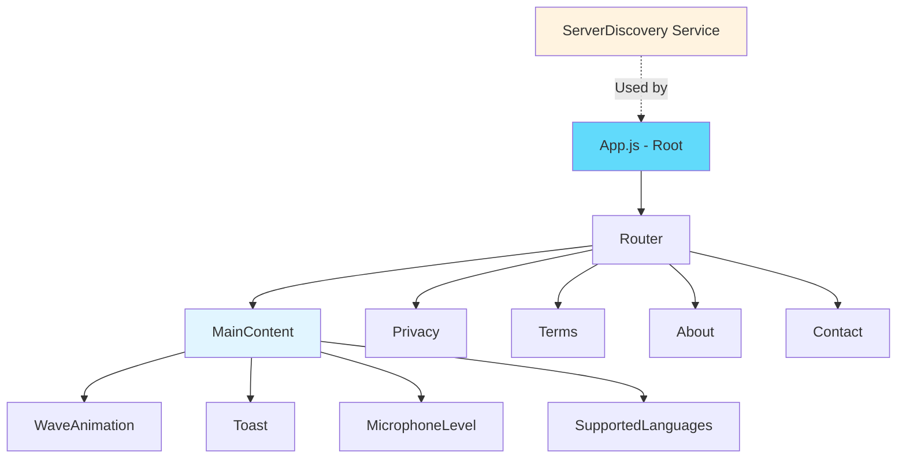
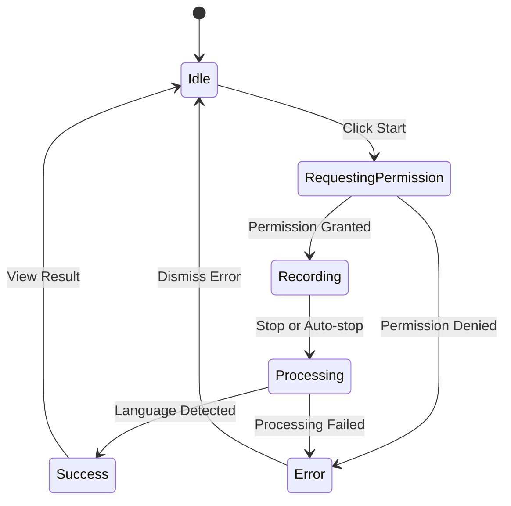

## Overview

The LangShazam frontend is a React single-page application (SPA) that provides a real-time language detection interface. It leverages modern browser APIs for audio capture and WebSocket communication, delivering a responsive and intuitive user experience.

## Application Structure

### Main Application Component

**Location:** `frontend/language-detector-ui/src/App.js`

The root `App` component orchestrates the entire application, managing state, audio capture, WebSocket communication, and routing.

<Card title="Component Architecture" icon="sitemap">
  The application follows a single-component architecture with modular sub-components for specific UI features.
</Card>

## Component Hierarchy



### Core Components

<Accordion title="App.js - Main Application">
  **Location:** `App.js`  
  **Lines of Code:** 311
  
  The primary container that manages:
  - Application state (listening status, language results, errors)
  - Audio recording lifecycle
  - WebSocket connection management
  - Routing between pages
  - Server discovery integration
  
  Reference: `App.js:1-311`
</Accordion>

<Accordion title="WaveAnimation - Visual Feedback">
  **Location:** `components/WaveAnimation.js`  
  **Purpose:** Animated wave visualization during recording
  
  ```jsx
  const WaveAnimation = ({ isRecording }) => {
    if (!isRecording) return null;
    
    return (
      <div className="wave-animation">
        <div className="wave"></div>
        <div className="wave"></div>
        <div className="wave"></div>
        <div className="wave"></div>
        <div className="wave"></div>
      </div>
    );
  };
  ```
  
  Reference: `WaveAnimation.js:1-15`
</Accordion>

<Accordion title="Toast - Notification System">
  **Location:** `components/Toast.js`  
  **Purpose:** Displays temporary success/error messages
  
  Features:
  - Auto-dismissal after 3 seconds
  - Success and error variants
  - Smooth show/hide animations
  
  ```jsx
  const Toast = ({ message, type = 'success', show, onHide }) => {
    useEffect(() => {
      if (show) {
        const timer = setTimeout(() => {
          onHide();
        }, 3000);
        return () => clearTimeout(timer);
      }
    }, [show, onHide]);
    // ...
  };
  ```
  
  Reference: `Toast.js:1-23`
</Accordion>

<Accordion title="MicrophoneLevel - Audio Indicator">
  **Location:** `components/MicrophoneLevel.js`  
  **Purpose:** Real-time visual representation of microphone input level
  
  ```jsx
  const MicrophoneLevel = ({ level = 0 }) => {
    return (
      <div className="mic-level">
        <div 
          className="mic-level-fill" 
          style={{ transform: `scaleX(${Math.min(level, 1)})` }}
        />
      </div>
    );
  };
  ```
  
  Reference: `MicrophoneLevel.js:1-12`
</Accordion>

<Accordion title="SupportedLanguages - Language Browser">
  **Location:** `components/SupportedLanguages.js`  
  **Purpose:** Expandable panel showing 57+ supported languages with search
  
  Features:
  - 57 supported languages with flag icons
  - Real-time search filtering
  - Grid layout with flags and names
  - Toggle expand/collapse
  
  Reference: `SupportedLanguages.js:1-110`
</Accordion>

## State Management

### State Architecture

LangShazam uses React hooks for state management without external libraries like Redux. All state is managed within the `App` component.

<Card title="State Management Pattern" icon="diagram-project">
  **Approach:** Local component state with React hooks (useState, useEffect)  
  **Rationale:** Simple, lightweight, sufficient for single-component architecture
</Card>

### State Variables

```javascript
const [isListening, setIsListening] = useState(false);
const [language, setLanguage] = useState('');
const [error, setError] = useState('');
const [micLevel, setMicLevel] = useState(0);
const [toast, setToast] = useState({ show: false, message: '', type: 'success' });
const [audioBuffer, setAudioBuffer] = useState([]);
const [mediaRecorder, setMediaRecorder] = useState(null);
const [wsConnection, setWsConnection] = useState(null);
const [isRequestingPermission, setIsRequestingPermission] = useState(false);
const [serverUrl, setServerUrl] = useState(null);
const [isConnected, setIsConnected] = useState(false);
const [webSocket, setWebSocket] = useState(null);
```

Reference: `App.js:18-32`

### State Categories

<CardGroup cols={2}>
  <Card title="Recording State" icon="microphone">
    - `isListening` - Recording active status
    - `micLevel` - Current microphone input level
    - `isRequestingPermission` - Mic permission request status
  </Card>
  
  <Card title="Result State" icon="language">
    - `language` - Detected language result
    - `error` - Error messages
    - `toast` - Notification state
  </Card>
  
  <Card title="Connection State" icon="wifi">
    - `serverUrl` - Discovered WebSocket URL
    - `isConnected` - WebSocket connection status
    - `wsConnection` / `webSocket` - WebSocket instances
  </Card>
  
  <Card title="Audio State" icon="waveform">
    - `audioBuffer` - Buffered audio chunks
    - `mediaRecorder` - MediaRecorder instance
  </Card>
</CardGroup>

## Audio Capture Implementation

### MediaRecorder API Integration

<Steps>
  <Step title="Request Microphone Permission">
    ```javascript
    const stream = await navigator.mediaDevices.getUserMedia({ audio: true });
    ```
    
    Reference: `App.js:77`
  </Step>
  
  <Step title="Initialize Audio Context">
    ```javascript
    const audioContext = new AudioContext();
    const source = audioContext.createMediaStreamSource(stream);
    const analyser = audioContext.createAnalyser();
    source.connect(analyser);
    ```
    
    Creates Web Audio API nodes for real-time audio level monitoring.
    
    Reference: `App.js:81-84`
  </Step>
  
  <Step title="Monitor Audio Levels">
    ```javascript
    analyser.fftSize = 256;
    const dataArray = new Uint8Array(analyser.frequencyBinCount);
    
    const updateLevel = () => {
      if (!isListening) return;
      analyser.getByteFrequencyData(dataArray);
      const average = dataArray.reduce((a, b) => a + b) / dataArray.length;
      setMicLevel(average / 128);
      requestAnimationFrame(updateLevel);
    };
    ```
    
    Uses `requestAnimationFrame` for smooth visual updates.
    
    Reference: `App.js:87-96`
  </Step>
  
  <Step title="Create MediaRecorder">
    ```javascript
    const recorder = new MediaRecorder(stream, {
      mimeType: 'audio/mp4',
      audioBitsPerSecond: 16000
    });
    ```
    
    Uses MP4 format for wide compatibility including iOS.
    
    Reference: `App.js:158-161`
  </Step>
  
  <Step title="Start Recording">
    ```javascript
    recorder.start(4000); // Collect 4 seconds before sending
    ```
    
    Reference: `App.js:189`
  </Step>
</Steps>

### Audio Configuration

```javascript
const CHUNK_SIZE = 128 * 1024; // 128KB chunks
const MIN_AUDIO_LENGTH = 4000; // 4 seconds minimum
const MAX_AUDIO_LENGTH = 15000; // 15 seconds maximum
```

Reference: `App.js:24-26`

<Note>
  The frontend enforces a 15-second maximum recording time to prevent excessive audio data and ensure timely results.
</Note>

## WebSocket Client Implementation

### Connection Lifecycle

<Card title="Server Discovery" icon="magnifying-glass">
  Before establishing WebSocket connection, the app discovers the server URL using the `ServerDiscovery` service.
</Card>

**Server Discovery** (`App.js:34-42`):

```javascript
useEffect(() => {
  const discoverServer = async () => {
    const url = await ServerDiscovery.discoverServer();
    console.log("🔍 Discovered server:", url);
    setServerUrl(url);
  };
  
  discoverServer();
}, []);
```

### WebSocket Connection

<Accordion title="Connection Establishment">
  ```javascript
  const ws = new WebSocket(serverUrl);
  
  ws.onopen = () => {
    console.log("WebSocket connection established successfully");
    setIsConnected(true);
  };
  ```
  
  Reference: `App.js:111-116`
</Accordion>

<Accordion title="Sending Audio Data">
  ```javascript
  recorder.ondataavailable = async (event) => {
    if (event.data.size > 0) {
      console.log("Received audio chunk of size:", event.data.size);
      ws.send(event.data);
    }
  };
  ```
  
  Audio chunks are sent as binary blobs directly through the WebSocket.
  
  Reference: `App.js:167-172`
</Accordion>

<Accordion title="Receiving Results">
  ```javascript
  ws.onmessage = (event) => {
    const response = JSON.parse(event.data);
    if (response.status === 'success') {
      setLanguage(response.data.language);
      showToast(`Language detected: ${response.data.language}`, 'success');
    } else {
      setError(response.message);
      showToast(response.message, 'error');
    }
    setIsListening(false);
    stream.getTracks().forEach(track => track.stop());
    ws.close();
  };
  ```
  
  Reference: `App.js:174-187`
</Accordion>

<Accordion title="Error Handling">
  ```javascript
  ws.onerror = (event) => {
    console.error('WebSocket error details:', {
      readyState: ws.readyState,
      url: ws.url,
      timestamp: new Date().toISOString(),
      protocol: window.location.protocol,
      hostname: window.location.hostname,
      // ... extensive error details
    });
    setIsConnected(false);
    setError('Connection error occurred');
    showToast('Connection error occurred', 'error');
  };
  ```
  
  Comprehensive error logging for debugging connection issues.
  
  Reference: `App.js:131-153`
</Accordion>

<Accordion title="Connection Closure">
  ```javascript
  ws.onclose = (event) => {
    console.log("WebSocket connection closed:", {
      code: event.code,
      reason: event.reason,
      wasClean: event.wasClean,
      timestamp: new Date().toISOString(),
    });
    setIsConnected(false);
  };
  ```
  
  Reference: `App.js:118-129`
</Accordion>

## UI/UX Patterns

### User Interaction Flow



### Visual Feedback Components

<CardGroup cols={2}>
  <Card title="Wave Animation" icon="water">
    5 animated wave elements displayed during recording
    
    **Trigger:** `isListening === true`
  </Card>
  
  <Card title="Microphone Level" icon="signal">
    Real-time visual bar showing audio input level
    
    **Update Rate:** 60fps via requestAnimationFrame
  </Card>
  
  <Card title="Toast Notifications" icon="message">
    Auto-dismissing notifications for success/error
    
    **Duration:** 3 seconds
  </Card>
  
  <Card title="Status Indicator" icon="circle-info">
    Text prompts guiding user through recording process
    
    **States:** Recording, Processing, Result, Error
  </Card>
</CardGroup>

### Button States

<Tabs>
  <Tab title="Start Button">
    ```jsx
    <button 
      onClick={startListening} 
      disabled={isListening || isRequestingPermission}
      className="start-button"
    >
      {isListening ? (
        <span className="listening-animation"></span>
      ) : isRequestingPermission ? (
        <>⏳ Requesting microphone access...</>
      ) : (
        <>🎙️ Start Detection</>
      )}
    </button>
    ```
    
    Reference: `App.js:221-236`
  </Tab>
  
  <Tab title="Stop Button">
    ```jsx
    {isListening && (
      <button 
        onClick={stopListening}
        className="stop-button"
      >
        ⏹️ Stop Recording
      </button>
    )}
    ```
    
    Conditionally rendered only during recording.
    
    Reference: `App.js:238-245`
  </Tab>
</Tabs>

## Routing Architecture

### React Router Integration

**Location:** `App.js:297-307`

```jsx
<Router>
  <Routes>
    <Route path="/" element={<MainContent />} />
    <Route path="/privacy" element={<Privacy />} />
    <Route path="/terms" element={<Terms />} />
    <Route path="/about" element={<About />} />
    <Route path="/contact" element={<Contact />} />
  </Routes>
</Router>
```

<Card title="Navigation Pattern" icon="compass">
  The footer contains links to legal and informational pages:
  
  ```jsx
  <footer className="footer">
    <div className="footer-links">
      <Link to="/privacy">Privacy Policy</Link>
      <Link to="/terms">Terms of Service</Link>
      <Link to="/about">About</Link>
      <Link to="/contact">Contact</Link>
    </div>
  </footer>
  ```
  
  Reference: `App.js:281-293`
</Card>

## Service Layer

### ServerDiscovery Service

**Location:** `services/ServerDiscovery.js`

<Card title="Purpose" icon="server">
  Abstracts server endpoint discovery, allowing for dynamic backend URL configuration.
</Card>

```javascript
const AWS_ENDPOINT = "wss://3.149.10.154.nip.io/ws";

class ServerDiscovery {
  static async discoverServer() {
    console.log('Using AWS Kubernetes server:', AWS_ENDPOINT);
    return AWS_ENDPOINT;
  }
}
```

Reference: `ServerDiscovery.js:1-11`

<Note>
  The service currently returns a static AWS Kubernetes endpoint but provides a foundation for implementing dynamic service discovery in the future.
</Note>

## Event Handling

### Key Event Handlers

<Accordion title="startListening()">
  **Purpose:** Initiates audio recording and WebSocket connection
  
  **Flow:**
  1. Validate server URL
  2. Request microphone permission
  3. Initialize audio context and analyser
  4. Establish WebSocket connection
  5. Create and start MediaRecorder
  6. Set up event handlers
  
  Reference: `App.js:68-211`
</Accordion>

<Accordion title="stopListening()">
  **Purpose:** Stops recording and sends final audio data
  
  ```javascript
  const stopListening = () => {
    if (mediaRecorder && mediaRecorder.state === 'recording') {
      mediaRecorder.stop();
      if (audioBuffer.length > 0) {
        const audioBlob = new Blob(audioBuffer, { type: 'audio/webm' });
        wsConnection.send(audioBlob);
      }
      setIsListening(false);
      mediaRecorder.stream.getTracks().forEach(track => track.stop());
      wsConnection.close();
    }
  };
  ```
  
  Reference: `App.js:52-66`
</Accordion>

<Accordion title="showToast()">
  **Purpose:** Display notification to user
  
  ```javascript
  const showToast = (message, type = 'success') => {
    setToast({ show: true, message, type });
  };
  ```
  
  Reference: `App.js:44-46`
</Accordion>

## Browser API Usage

<CardGroup cols={2}>
  <Card title="MediaDevices API" icon="microphone">
    `navigator.mediaDevices.getUserMedia()`
    
    Requests access to user's microphone
  </Card>
  
  <Card title="MediaRecorder API" icon="record-vinyl">
    `new MediaRecorder(stream, options)`
    
    Records audio stream to MP4 format
  </Card>
  
  <Card title="Web Audio API" icon="wave-square">
    `AudioContext`, `AnalyserNode`
    
    Real-time audio analysis and visualization
  </Card>
  
  <Card title="WebSocket API" icon="plug">
    `new WebSocket(url)`
    
    Bidirectional real-time communication
  </Card>
</CardGroup>

## Performance Optimizations

<Card title="Optimization Strategies" icon="bolt">
  The frontend implements several performance optimizations:
</Card>

<Accordion title="RequestAnimationFrame for Smooth Animations">
  ```javascript
  const updateLevel = () => {
    if (!isListening) return;
    analyser.getByteFrequencyData(dataArray);
    const average = dataArray.reduce((a, b) => a + b) / dataArray.length;
    setMicLevel(average / 128);
    requestAnimationFrame(updateLevel);
  };
  ```
  
  Uses browser's animation frame for optimal 60fps updates.
  
  Reference: `App.js:90-96`
</Accordion>

<Accordion title="Chunked Audio Transmission">
  ```javascript
  recorder.start(4000); // Collect 4 seconds before sending
  ```
  
  Reduces network overhead by batching audio data.
  
  Reference: `App.js:189`
</Accordion>

<Accordion title="Conditional Rendering">
  Components only render when needed:
  
  ```javascript
  {isListening && (
    <>
      <WaveAnimation isRecording={isListening} />
      <MicrophoneLevel level={micLevel} />
    </>
  )}
  ```
  
  Minimizes unnecessary DOM updates.
</Accordion>

<Accordion title="Cleanup on Unmount">
  ```javascript
  return () => {
    clearTimeout(recordingTimeout);
    stopListening();
  };
  ```
  
  Prevents memory leaks by cleaning up resources.
  
  Reference: `App.js:199-202`
</Accordion>

## Dependencies

From `package.json:5-14`:

| Package | Version | Purpose |
|---------|---------|----------|
| react | 18.2.0 | Core UI framework |
| react-dom | 18.2.0 | DOM rendering |
| react-router-dom | 6.22.3 | Client-side routing |
| country-flag-icons | 1.5.18 | Flag icons for languages |
| react-scripts | 5.0.1 | Build tooling (CRA) |
| web-vitals | 2.1.4 | Performance monitoring |

## Error Handling Strategy

<Steps>
  <Step title="Permission Errors">
    ```javascript
    catch (err) {
      console.error('Error:', err);
      setError(err.message);
      showToast(err.message, 'error');
      setIsListening(false);
      setIsRequestingPermission(false);
    }
    ```
    
    Reference: `App.js:204-210`
  </Step>
  
  <Step title="WebSocket Errors">
    Comprehensive logging with connection details for debugging
    
    Reference: `App.js:131-153`
  </Step>
  
  <Step title="Processing Errors">
    Server-side errors are displayed via toast notifications
    
    Reference: `App.js:181-183`
  </Step>
</Steps>

## Related Documentation

<CardGroup cols={2}>
  <Card title="Architecture Overview" icon="diagram-project" href="/architecture/overview">
    High-level system architecture and technology stack
  </Card>
  <Card title="Backend Architecture" icon="server" href="/architecture/backend">
    FastAPI backend implementation details
  </Card>
</CardGroup>