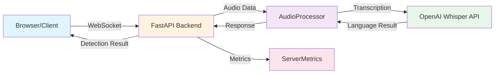

## System Architecture

LangShazam is a real-time spoken language detection service built with a modern, scalable architecture that processes audio streams and identifies the spoken language using OpenAI's Whisper model.

### Architecture Diagram



### Component Interaction Flow

<Steps>
  <Step title="Audio Capture">
    The React frontend captures audio from the user's microphone using the Web Audio API and MediaRecorder API
  </Step>
  <Step title="WebSocket Connection">
    Audio data is streamed to the backend via WebSocket connection at `/ws` endpoint
  </Step>
  <Step title="Audio Processing">
    The backend's AudioProcessor receives audio chunks and sends them to OpenAI's Whisper API
  </Step>
  <Step title="Language Detection">
    OpenAI's Whisper model analyzes the audio and returns the detected language
  </Step>
  <Step title="Result Delivery">
    The detection result is sent back to the client through the WebSocket connection
  </Step>
</Steps>

## Technology Stack

### Backend

<CardGroup cols={2}>
  <Card title="FastAPI" icon="bolt">
    High-performance async web framework for Python
    
    **Version:** 0.109.0
  </Card>
  <Card title="Uvicorn" icon="server">
    Lightning-fast ASGI server
    
    **Version:** 0.27.0
  </Card>
  <Card title="OpenAI SDK" icon="brain">
    Integration with Whisper model for transcription
    
    **Version:** 1.66.3
  </Card>
  <Card title="WebSockets" icon="network-wired">
    Real-time bidirectional communication
    
    **Version:** 12.0
  </Card>
</CardGroup>

### Frontend

<CardGroup cols={2}>
  <Card title="React" icon="react">
    Component-based UI framework
    
    **Version:** 18.2.0
  </Card>
  <Card title="React Router" icon="route">
    Client-side routing for SPA navigation
    
    **Version:** 6.22.3
  </Card>
  <Card title="Web Audio API" icon="waveform">
    Native browser audio processing and visualization
  </Card>
  <Card title="MediaRecorder API" icon="microphone">
    Audio capture and encoding in the browser
  </Card>
</CardGroup>

### Additional Dependencies

- **psutil** (5.9.8) - System and process monitoring for metrics
- **python-multipart** (0.0.9) - Multipart form data parsing
- **country-flag-icons** (1.5.18) - Language flag icons for UI

## Communication Patterns

### WebSocket Protocol

<Note>
  LangShazam uses WebSocket for real-time, bidirectional communication between the frontend and backend.
</Note>

**Connection Flow:**

1. Client establishes WebSocket connection to `/ws` endpoint
2. Client streams audio data as binary chunks
3. Server processes audio when minimum threshold is reached (20KB)
4. Server responds with JSON containing detection results
5. Connection closes after result delivery

**Message Format (Server → Client):**

```json
{
  "status": "success",
  "data": {
    "language": "english",
    "confidence": 0.9,
    "processing_time": 1.23,
    "connection_id": "a1b2c3d4"
  },
  "timestamp": "2026-03-08T12:34:56.789Z",
  "connection_id": "a1b2c3d4"
}
```

### REST API Endpoints

<Accordion title="GET /">
  **Purpose:** Health check endpoint
  
  **Response:**
  ```json
  {
    "message": "Server is running!"
  }
  ```
</Accordion>

<Accordion title="GET /metrics">
  **Purpose:** Retrieve server performance metrics
  
  **Response:**
  ```json
  {
    "active_connections": 2,
    "total_requests": 150,
    "errors": 0,
    "avg_processing_time": 1.45,
    "memory_usage_mb": 256.5,
    "cpu_total_percent": 15.2,
    "cpu_per_core": [12.3, 18.1, 14.5, 16.0],
    "total_cpu_cores": 4,
    "effective_cores_used": 0.608
  }
  ```
</Accordion>

## Deployment Architecture

### Infrastructure

<Card title="Kubernetes on AWS" icon="cloud">
  The application is deployed on AWS using Kubernetes for container orchestration.
  
  **WebSocket Endpoint:** `wss://3.149.10.154.nip.io/ws`
</Card>

### Configuration

**Backend Configuration** (`backend/src/config/settings.py:6-11`):

```python
SERVER_CONFIG = {
    "host": "0.0.0.0",
    "port": int(os.getenv("PORT", "10000")),
    "debug": os.getenv("DEBUG", "false").lower() == "true"
}
```

### CORS Configuration

<Warning>
  The backend is configured to accept requests from specific origins for security.
</Warning>

Allowed origins include:
- Production: `langshazam.com` (HTTP/HTTPS)
- Development: `localhost:3000`, `localhost:5173`, `127.0.0.1:3000`, `127.0.0.1:5173`

Configuration reference: `backend/src/config/settings.py:14-23`

## Key Features

<CardGroup cols={2}>
  <Card title="Connection Tracing" icon="fingerprint">
    Each WebSocket connection receives a unique 8-character ID for request tracking and debugging
  </Card>
  <Card title="Rate Limiting" icon="gauge">
    API calls are limited to 3 concurrent requests using asyncio semaphores
  </Card>
  <Card title="Real-time Metrics" icon="chart-line">
    Continuous monitoring of connections, processing times, CPU usage, and memory
  </Card>
  <Card title="Adaptive Buffering" icon="buffer">
    Collects minimum 20KB of audio data before processing for better accuracy
  </Card>
</CardGroup>

## Audio Processing Parameters

From `backend/src/config/settings.py:26-32`:

| Parameter | Value | Description |
|-----------|-------|-------------|
| Min Audio Size | 20,000 bytes | Minimum buffer before processing |
| Chunk Size | 128 KB | Audio data chunk size |
| Min Audio Length | 4 seconds | Minimum recording duration |
| Max Audio Length | 15 seconds | Maximum recording duration |
| Bits Per Second | 16,000 | Audio encoding bitrate |

## Next Steps

<CardGroup cols={2}>
  <Card title="Backend Architecture" icon="server" href="/architecture/backend">
    Dive deep into the FastAPI backend implementation
  </Card>
  <Card title="Frontend Architecture" icon="desktop" href="/architecture/frontend">
    Explore the React frontend structure and patterns
  </Card>
</CardGroup>